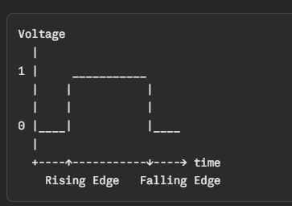
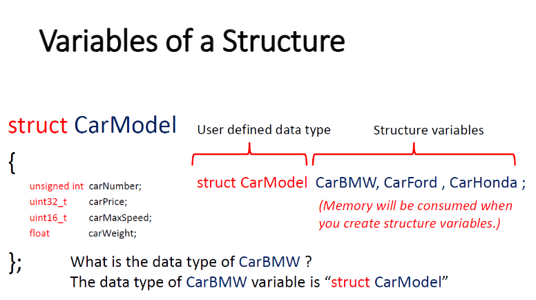
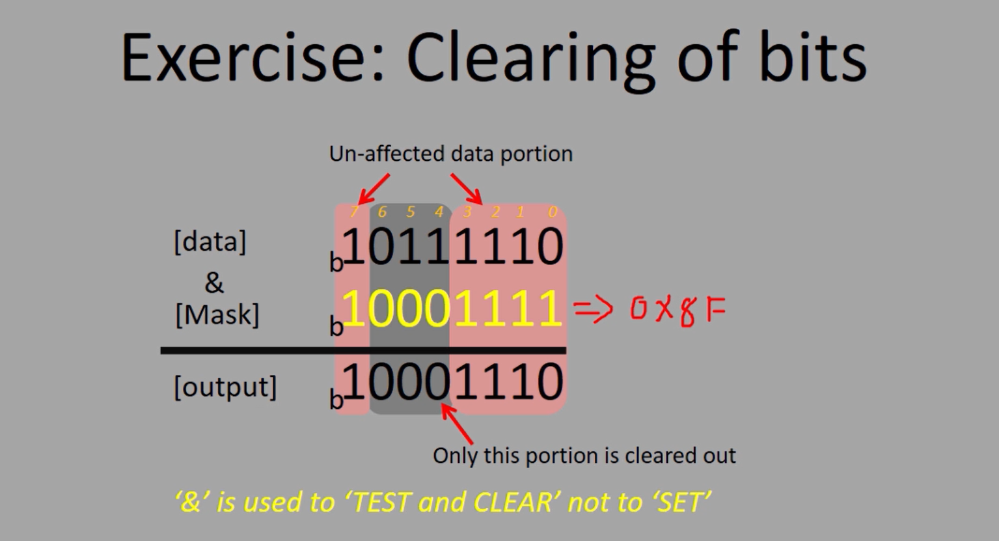
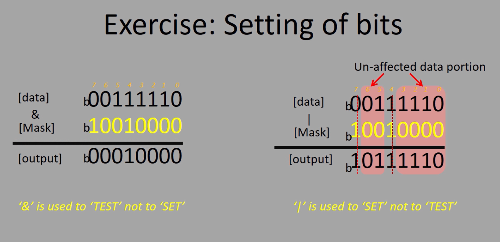
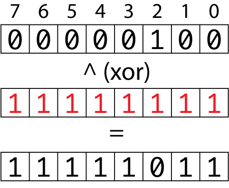
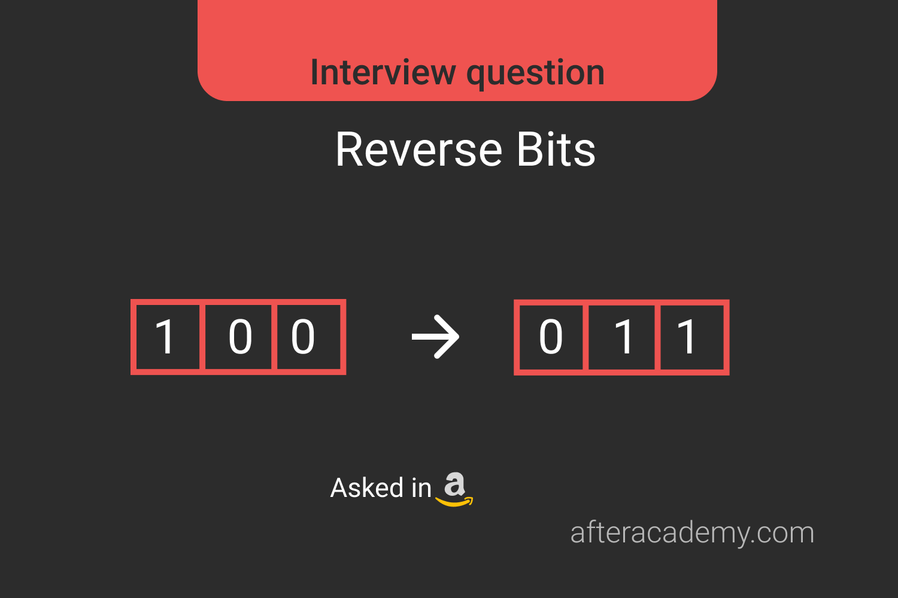
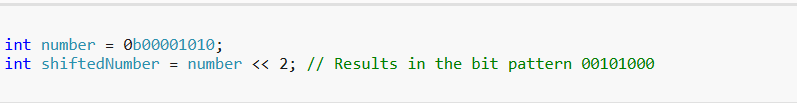
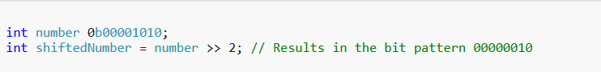
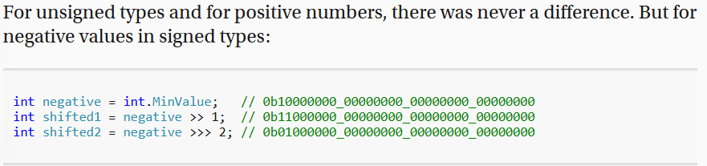
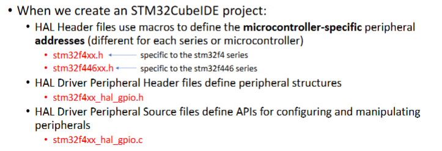

This is files/HWs for the class EE 3314 taught at UTA 
by the professor Jon Mitchell. 

Some concepts and definitions to get you started for Fundamentals of Embedded Systems. 

# Vocabulary 

### Rising Edge: Triggers when something goes from False -> True 
### Falling Edge: Triggers when somethign goes from True -> False 

The edge is just the **EXACT** moment of change - not while it's on, not while it's off, but the instant it switches. 

### Structs: Structures (strcuts for short) are data structures used to create user-defined data types in 'C'. They allow us to combine different data types.
Main purpose are for data organization, modularity, and creation of complex data structures. 

## Pointers
### Pointer: A variable that stores the **MEMORY ADDRESS** of another variable 
The main two symbols when using a pointer are the *&* and * operators. 
& - Gets the **MEMORY ADDRESS** of a variable 
* - Gets the **VALUE** at the pointer's ADDRESS
Example 1: 

    int x = 42;

    int *ptr = &x; //ptr holds the address of x (some random hex code) 

    printf("Value of x        : %d\n", x);
    printf("Address of x      : %p\n", (void*)&x);
    printf("ptr holds address : %p\n", (void*)ptr);
    printf("Value via *ptr    : %d\n", *ptr);

Modifying the value through the pointer: 
*ptr = 99; 
printf("After *ptr = 99, x is now: %d\n", x);

== Pointer Output == 
Value of x        : 42
Address of x      : 0x7ffee4b4a8ac
ptr holds address : 0x7ffee4b4a8ac
Value via *ptr    : 42

=== Modify via Pointer ===
After *ptr = 99, x is now: 99

The 2 main reasons you use pointers are:

1) No direct access to variable inside a function 

Example: 

    void setToFive(int *ptr) {
        *ptr = 5;  // only way to reach x from here
    }

    int main() {
        int x = 0;
        setToFive(&x);
        printf("%d\n", x); // Output: 5
    }

Example 2: 

    void changeValue(int x) {  // C makes a COPY of x here
        x = 99;                // only changes the COPY, not the original!
    }

    int main() {
        int x = 42;
        printf("Before: %d\n", x); // Output: 42
        changeValue(x);
        printf("After : %d\n", x); // Output: 42  <-- x never changed!
        return 0;
    }

C is passed by value, where functions always get a copy. The only way to modify it is to pass its address(pointer) so the function knows exactly where in the memory to make the change. 

2) Avoiding expensive copies 

When you pass a variable to a function without a pointer, C makes a full copy of it. For large data structures, its slow and wasteful

// ❌ BAD - entire struct is copied every call (expensive!)

void printStudent(Student s) { ... }

// ✅ GOOD - only the address is passed (just 8 bytes!)

void printStudent(Student *s) { ... }

### Bitwise Operations 
There are 6 main bitwise operations in C: 

& - AND - Clears the Bits (turning something off) 

| - OR - Set the bits (turning something on) 

^ - XOR - Toggle the bits (flip states)

~ - NOT - Invert the bits 

**Bit Shifting**

<< - Left Shift - Build bit mask

>> - Right Shift - Extract bit mask 

Right shifting with >> dose not *always* result in values being filled in with zeroes. 

- If you right shift an unsigned type (ulong, uint, ushort, or byte) then the left end will always be filled with zeroes.

- If you right shift a signed type (long, int, short, or sbyte) and the number is positive, then the left end will be filled with zeroes

- However, if you right shift a signed type and the number is negative, then the left end will be filled with ones.  

Shifting is just a efficient way to multiply or divide integers by the power of two. 

Example: 

//left shift 

00000011 << 1 -> goes out to 00000110, which is 6

00000011 << 2 -> goes out to 00001100, which is 12

//right shift 

00000110 >> 1 -> goes out to 00000011, which is 3

00000110 >> 2 -> goes out to 00000001, which is 1 (technically 3/2 but it's 1 since it's an integer)

Although it's a more efficient way for the computer to save speed and be efficient, it's lowkey used not that often just because of nomenclature. You want to make your code easy to read and universal to understand, so having 00000011 << 2 isn't as necessary as 3 * 4. Only use cases for this is if you are in the atmost extreme zero in all circumstances where you would need to treat all bits and memory to be super efficient. 

### Type Qualifiers 

*const*: keyword used to make variables constant, meaning that their values **cannot** be changed after initialization. 

- If you try to modify a const variable, the compiler will give you an error 

- It helps to avoid accidental changes to important values in the program and helps the compilier optimize the code since it knows that the value won't change. 

- You can use const with variables, pointers, function parameters, and class methods to make them unchangeable. 

Example 1: 

const uint32_t SYSTEM_CLOCK_HZ = 84000000UL; // 84 MHz, stored in Flash

const uint8_t LOOKUP_TABLE[] = {0x00, 0x01, 0x03, 0x07, 0x0F}; // ROM table

*volatile*: marks a variable whose value can change unexpectedly outside the normal program flow 

- When we declare a variable as volatile, the compiler is instructed to *not* optimize the code involing this variable to ensure that every access to the variable is directly from its actual memory location 

- Most comonly used for hardware registers, interrupts, or shared variables in multithreading. 

Example 1: 

// Without volatile, the compiler might optimize the loop away!
volatile uint32_t *pGPIOA_IDR = (volatile uint32_t *)0x40020010;

while ((*pGPIOA_IDR & (1 << 0)) == 0) {
    // Wait for PA0 to go HIGH
}

**Const and volatile when using pointers** 
When using pointers, const and volatile are important as to determine what the pointer can do. 

volatile int * const ptr - this is a constant pointer, where the address CANNOT change, but the value AT that address CAN change

const int * volatile ptr - this is a pointer whose address CAN change but the value AT the address CANNOT change 

## STM32 Architecture & Bare-metal Programming 

### Memory Mapping 
### Register Addressing 
### Peripheral Clock/Enable Register 
### GPIO Output Data Register

### NVIC 
### Polling 
### Interrupts 
### Interrupt Priority 
### ISR 

## Hardware Abstraction Layer

### HAL: The Hardware Abstraction Layer allows us to create portable code that uses APIs to access peripherals and other hardware-specific registers (makes life so much easier) 

### UART 

### USART

### Timers 

