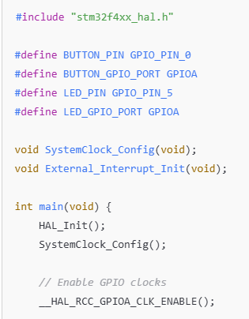
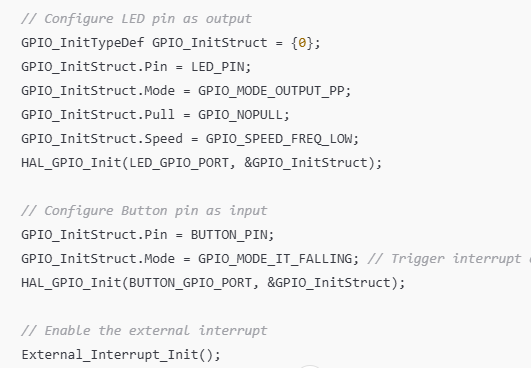
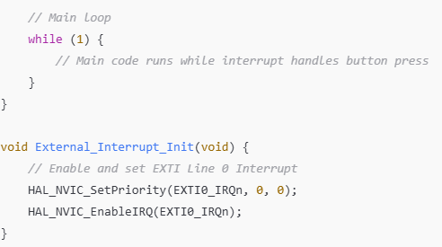
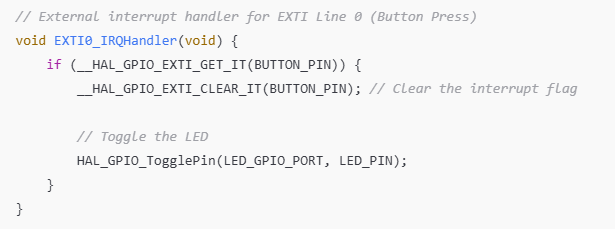
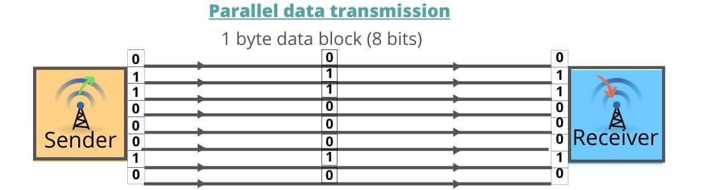
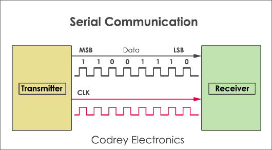
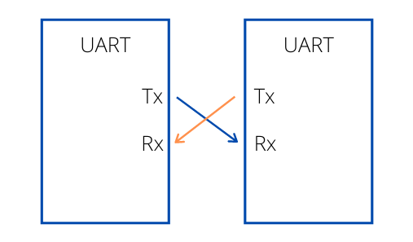
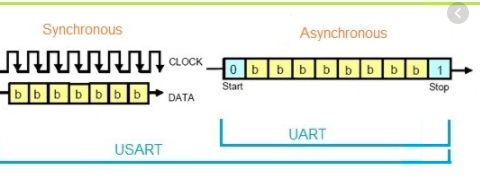

# EE 3314 — Fundamentals of Embedded Systems

> 📚 Course files and homework for **EE 3314** at **UT Arlington**, taught by **Professor Jon Mitchell**.
> This README serves as a quick-reference guide for key concepts in Embedded Systems.

---

## 📋 Table of Contents

| # | Topic |
|---|-------|
| 1 | [Rising Edge](#rising-edge) |
| 2 | [Falling Edge](#falling-edge) |
| 3 | [Structs](#structs) |
| 4 | [Pointers](#pointers) |
| 5 | [Bitwise Operations](#bitwise-operations) |
| 6 | [Type Qualifiers](#type-qualifiers) |
| 7 | [Memory Mapping](#memory-mapping) |
| 8 | [Register Addressing](#register-addressing) |
| 9 | [Peripheral Clock/Enable Register](#peripheral-clockenable-register) |
| 10 | [GPIO Output Data Register](#gpio-output-data-register) |
| 11 | [NVIC](#nvic) |
| 12 | [Polling](#polling) |
| 13 | [Interrupts](#interrupts) |
| 14 | [EXTI](#exti) |
| 15 | [ISR](#isr) |
| 16 | [Callback Functions](#callback-functions) |
| 17 | [HAL](#hal) |

---

## ⚡ Signal Edges

### Rising Edge
> Triggers when a signal transitions **False → True** (LOW to HIGH)

### Falling Edge
> Triggers when a signal transitions **True → False** (HIGH to LOW)

> 💡 **Key Insight:** The edge is the **exact instant** of change — not while it's high, not while it's low, but the precise moment it switches.


---

## 🧱 Structs

Structures (`struct` for short) are data structures used to create **user-defined data types** in C. They allow you to combine multiple different data types under one name.

**Main purposes:**
- 📦 Data organization
- 🔧 Modularity
- 🏗️ Creation of complex data structures


---

## 🔗 Pointers

A **pointer** is a variable that stores the **memory address** of another variable.

### Key Operators

| Operator | Name | Description |
|----------|------|-------------|
| `&` | Address-of | Gets the **memory address** of a variable |
| `*` | Dereference | Gets the **value** at the pointer's address |

### Example — Basic Pointer Usage

```c
int x = 42;
int *ptr = &x;  // ptr holds the address of x

printf("Value of x        : %d\n", x);
printf("Address of x      : %p\n", (void*)&x);
printf("ptr holds address : %p\n", (void*)ptr);
printf("Value via *ptr    : %d\n", *ptr);

// Modifying the value through the pointer:
*ptr = 99;
printf("After *ptr = 99, x is now: %d\n", x);
```

**Output:**
```
Value of x        : 42
Address of x      : 0x7ffee4b4a8ac
ptr holds address : 0x7ffee4b4a8ac
Value via *ptr    : 42

After *ptr = 99, x is now: 99
```

---

### Why Use Pointers?

#### 1️⃣ Modifying Variables Inside Functions

C is **pass-by-value** — functions always receive a *copy* of the variable. The only way to modify the original is to pass its address.

```c
// ✅ Using a pointer — modifies the original
void setToFive(int *ptr) {
    *ptr = 5;
}

int main() {
    int x = 0;
    setToFive(&x);
    printf("%d\n", x); // Output: 5
}
```

```c
// ❌ Without a pointer — only modifies the copy
void changeValue(int x) {
    x = 99;  // Only changes the local copy!
}

int main() {
    int x = 42;
    printf("Before: %d\n", x); // Output: 42
    changeValue(x);
    printf("After : %d\n", x); // Output: 42  ← x never changed!
    return 0;
}
```

#### 2️⃣ Avoiding Expensive Copies

Passing large data structures by value forces C to copy the entire thing — slow and wasteful.

```c
// ❌ BAD — entire struct is copied on every call (expensive!)
void printStudent(Student s) { ... }

// ✅ GOOD — only the address is passed (just 8 bytes!)
void printStudent(Student *s) { ... }
```

---

## 🔢 Bitwise Operations

There are **6 main bitwise operations** in C:

| Operator | Name | Purpose |
|----------|------|---------|
| `&` | AND | Clear bits (turn something **off**) |
| `\|` | OR | Set bits (turn something **on**) |
| `^` | XOR | Toggle bits (flip states) |
| `~` | NOT | Invert all bits |
| `<<` | Left Shift | Build a bit mask |
| `>>` | Right Shift | Extract a bit mask |

---

### AND — Clearing Bits


### OR — Setting Bits


### XOR — Toggling Bits


### NOT — Inverting Bits


---

### Bit Shifting

#### Left Shift `<<` — Multiply by powers of 2


#### Right Shift `>>` — Divide by powers of 2


> ⚠️ **Right shift behavior depends on the type:**
> - **Unsigned types** (`uint`, `ulong`, etc.) → always fills with **0s**
> - **Signed types, positive number** → fills with **0s**
> - **Signed types, negative number** → fills with **1s**


### Shift Examples

```c
// Left Shift
00000011 << 1  →  00000110  =  6
00000011 << 2  →  00001100  =  12

// Right Shift
00000110 >> 1  →  00000011  =  3
00000110 >> 2  →  00000001  =  1  // integer division: 6/4 = 1
```

> 💡 **When to use bit shifting?** Shifting is more efficient than multiplication/division for the CPU, but it hurts readability. Only reach for it in **extreme performance-critical** scenarios where every cycle and byte matters. For most code, `3 * 4` is clearer than `00000011 << 2`.

---

## 🏷️ Type Qualifiers

### `const`

Makes a variable **constant** — its value cannot be changed after initialization.

**Benefits:**
- Prevents accidental modification of important values
- Helps the compiler optimize code
- Works with variables, pointers, function parameters, and methods

```c
const uint32_t SYSTEM_CLOCK_HZ = 84000000UL;                    // 84 MHz, stored in Flash
const uint8_t LOOKUP_TABLE[] = {0x00, 0x01, 0x03, 0x07, 0x0F}; // ROM table
```

---

### `volatile`

Marks a variable whose value **can change unexpectedly** outside of normal program flow.

Tells the compiler: *"Do NOT optimize accesses to this variable — always read directly from memory."*

**Most common use cases:**
- Hardware registers
- Interrupt service routines
- Shared variables in multithreading

```c
// Without volatile, the compiler might optimize this loop away entirely!
volatile uint32_t *pGPIOA_IDR = (volatile uint32_t *)0x40020010;

while ((*pGPIOA_IDR & (1 << 0)) == 0) {
    // Wait for PA0 to go HIGH
}
```

---

### `const` + `volatile` with Pointers

| Declaration | Address | Value at Address |
|-------------|---------|-----------------|
| `volatile int * const ptr` | ❌ Cannot change | ✅ Can change |
| `const int * volatile ptr` | ✅ Can change | ❌ Cannot change |

---

## 🏛️ STM32 Architecture & Bare-Metal Programming

### Memory Mapping
> 🚧 *Coming soon*

### Register Addressing
> 🚧 *Coming soon*

### Peripheral Clock/Enable Register
> 🚧 *Coming soon*

### GPIO Output Data Register
> 🚧 *Coming soon*

---

## 🔔 Interrupts & NVIC

### NVIC

The **Nested Vectored Interrupt Controller** is a built-in ARM Cortex-M component responsible for:
- Handling all interrupts
- Prioritizing them
- Enabling **preemption** (high-priority interrupts can interrupt lower-priority ones)

---

### Polling

**Polling** is the practice of continuously monitoring the status of a device or register.

> ⚠️ While polling, the microcontroller does **nothing else** — it consumes all processing time just watching and waiting. This is why interrupts exist.

---

### Interrupts

An **interrupt** is an asynchronous event — triggered by hardware (e.g., button press) or software (e.g., system call, divide-by-zero) — that temporarily **halts** normal program execution to handle a **higher-priority** task.

Once triggered, it executes the **Interrupt Service Routine (ISR)** to handle whatever needs to happen.

**Key benefits:**
- ⚡ Event-driven execution
- 🚀 Fast response time
- 🧠 Improved CPU efficiency
- ⏱️ Enables real-time behavior


---

### EXTI

**EXTI (External Interrupts)** are GPIO pins configured to trigger interrupts on:
- Rising edge
- Falling edge
- Both edges

Each GPIO pin connects to a corresponding EXTI line.

---

### ISR

The **Interrupt Service Routine** is the function that executes when an interrupt fires.

> 💡 **Best practice:** Keep ISRs **short and fast** — typically just set a flag, then process the data back in the main loop.

---

### Callback Functions

In the STM32 HAL library, `HAL_GPIO_EXTI_Callback()` is the most commonly used function to handle external interrupts after the main handler clears the flag.

---

### Steps to Implement Interrupts *(STM32CubeIDE)*

1. **Configure the Pin** — In the `.ioc` file, set the GPIO pin to `GPIO_EXTI` mode
2. **Enable the Interrupt** — In NVIC configuration, enable the corresponding EXTI line
3. **Configure the Trigger** — Set edge detection (rising/falling/both) in GPIO settings
4. **Implement the Handler** — Override `HAL_GPIO_EXTI_Callback()` in `main.c` or a user file

**Helpful Resources:**
- 📖 [STM32Wiki — Getting Started with EXTI](https://wiki.st.com/stm32mcu/wiki/Getting_started_with_EXTI)
- 🎥 [Terminal Two — Interrupts | #8 STM32 GPIO Button Interrupt](https://www.youtube.com/watch?v=qd_tevhJ2eE)

**Example Code:**






---

## 🧰 Hardware Abstraction Layer

### HAL

The **Hardware Abstraction Layer** lets you write **portable code** using APIs to access peripherals and hardware-specific registers — without needing to manually configure every register yourself.

> In short: HAL makes your life *significantly* easier. 🙌


---

### Parallel Data:
Multiple bits of data being sent simultaneously over several wires (typically 8, 16, or 32) 

- Very fast because you move a whole set of data in a single clock tick 

- The catch: requires a lot of wires and if the wires are too long, the signals can get jumbled. 

- Think of paralle Data like having multiple doors for the bits to go through 



---

### Serial Data:
Data bits are sent one after another, in a single line, over a single wire. 

- Typically only needs two wires, which is cheaper and takes up less space. Modern tech like USB or SATA have become so fast that serial communication is now the standard for almost everything 

- The catch: It's technically slower per "tick" but since we engineered it to be so fast, the speed makes up for it.



---

### UART
> A hardware communication protocol that uses asynchrnouns serial communication with configurable speed. Asynchronous meaning there is no clock signal to synchronize the output bits from the transmitting device going to the receiving end. 

- Instead of clock cycles, it uses pre-agreed speeds (baud rates) to start/stop bits to synchronize the communication. 

- Baud rate is the measure of the speeed of data transfer, expressed in bits per second.

- It is extensively usedi n embedded systems to connect sensors, bluetooth modules, and GPS units to microcontrollers 

- It is also commonly uses for Serial debugging allowing developers to monitor and control devices via tool's like the Arduino Serial Monitor

The two signals of UART device are called: 
- Transimitter (TX)
- Receiver (RX)

At the transmitter, the UART converts parallel data (e.g an 8-bit bye) into a serial streams of bits for transmission over the TX line. 

At the receiver, the process is reversed, building the original parallel data from the incoming serial bits. 




---

### USART
> The Universal Synchronous/Asynchronous Receiver-Transmitter is the versatile version of UART that can operate in both asynchronous and synchronous modes. 

- A USART is just a UART that has a clock signal 

- In the synchronous mode, the USART sends a clock signal along with the data on a seperate wire. This allows the receiver and trasmitter to stay perfectly in step. 

- It can reach faster data rates- often 4 Mbps or more, compared to the 115.2 kbps like the standard UART. 




### Timers
> 🚧 *Coming soon*

---

*Last updated for EE 3314 — UTA*
